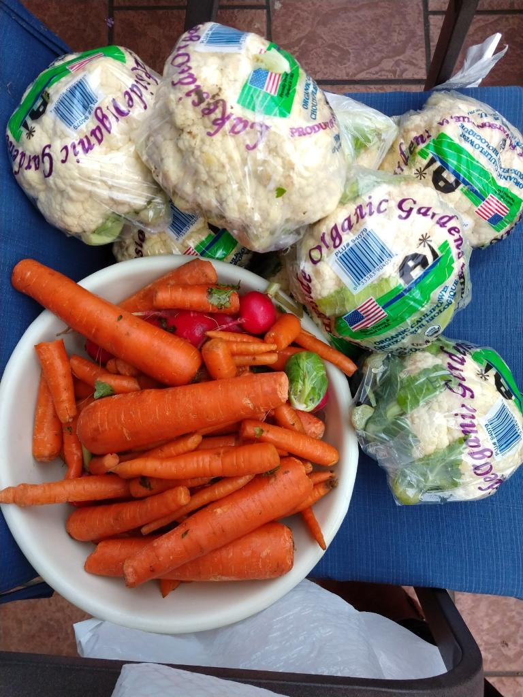
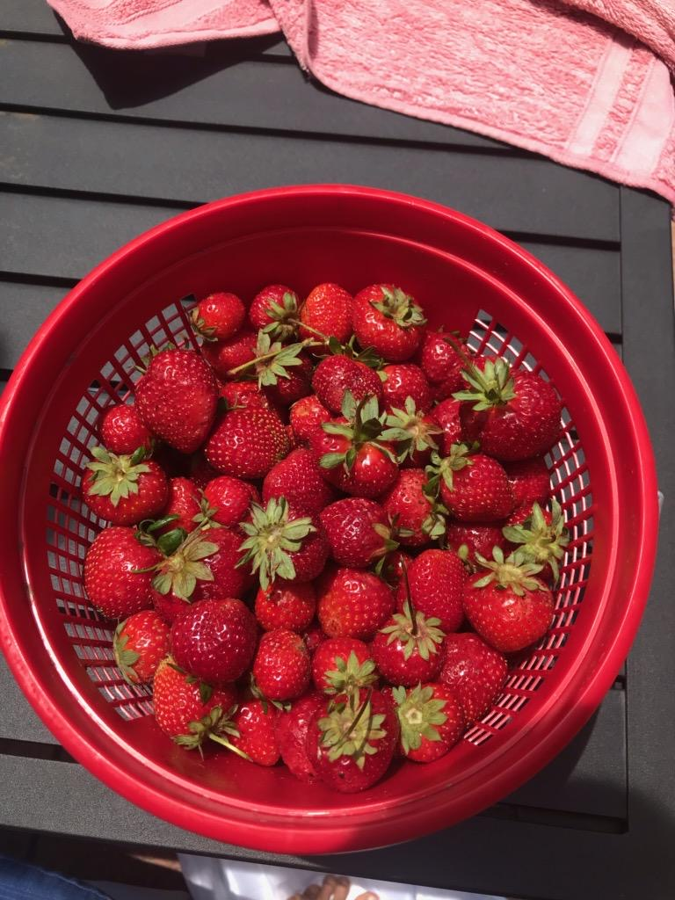
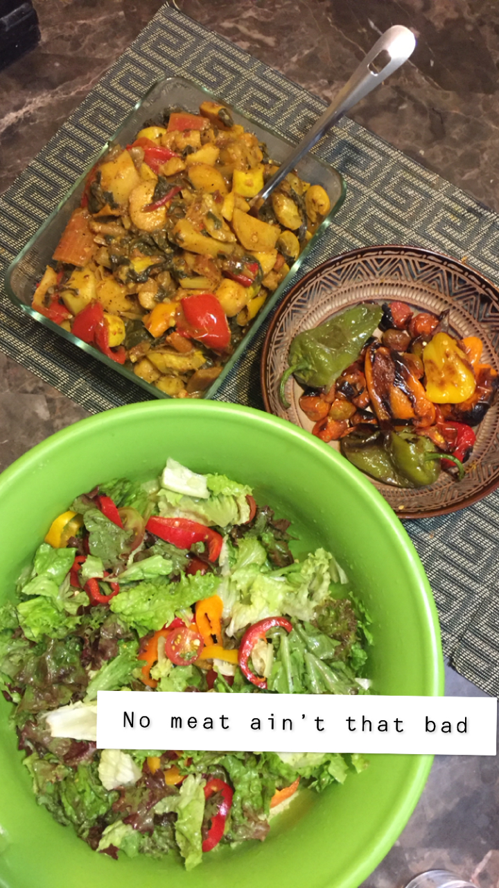
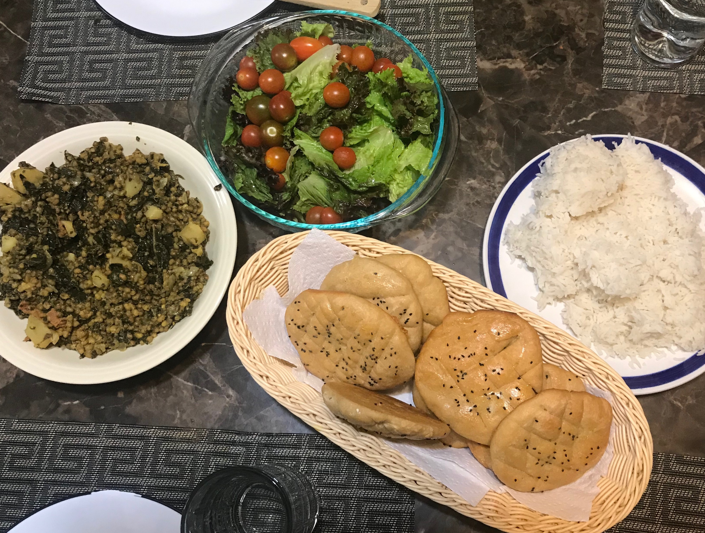

This page is devoted to my summer research entitled "You are what you eat: A Sustainable Food Project." This summer, I sought out to answer the question: is it possible to live sustainably in today's modern food complex? 
Here, "sustainable" refers to the ability to consistently make food descions leading to positive impacts. 
 
The following images overview some of the food of this research: 
 

 

 

 

 
